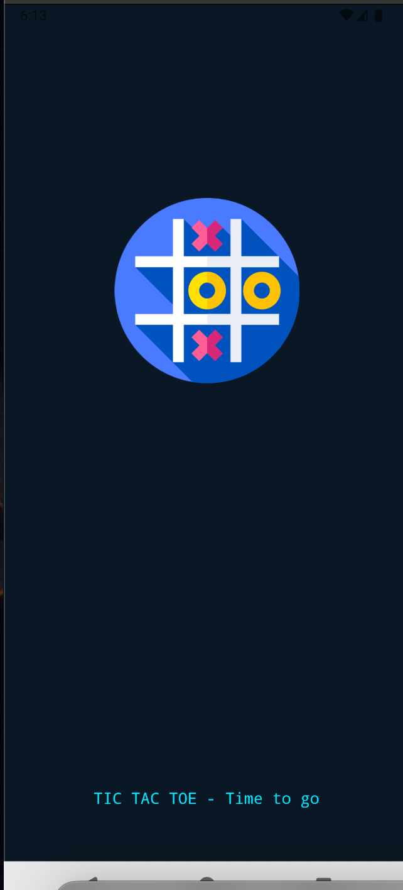
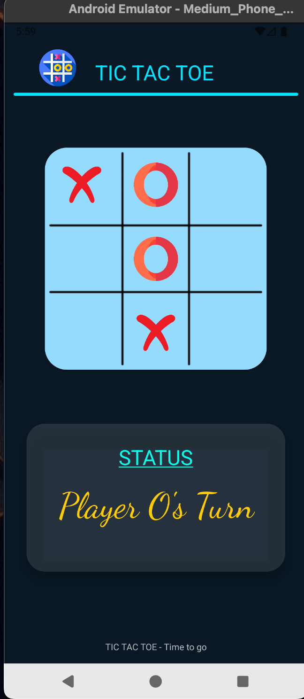

# Tic Tac Toe – Android Game (1ST YEAR REPO)

Welcome to Tic Tac Toe – a modern, simple yet engaging game built with `Kotlin + Android Studio`.  
Challenge yourself against the computer AI or just enjoy the clean design and smooth animations.

---

## Features

- Single Player mode (You vs Computer )
- Smart AI that makes valid moves
- Automatic game reset after **Win / Draw**
- Player turn indicator with **dynamic status updates**
- Beautiful **Material Design-inspired UI** with custom colors
- Lightweight & fast

---

## Screenshots

  
   
   
  

---

## Tech Stack

- **Language:** Kotlin
- **IDE:** Android Studio
- **UI:** ConstraintLayout + CardView + Custom Drawables
- **Architecture:** Simple Activity-based flow

---
